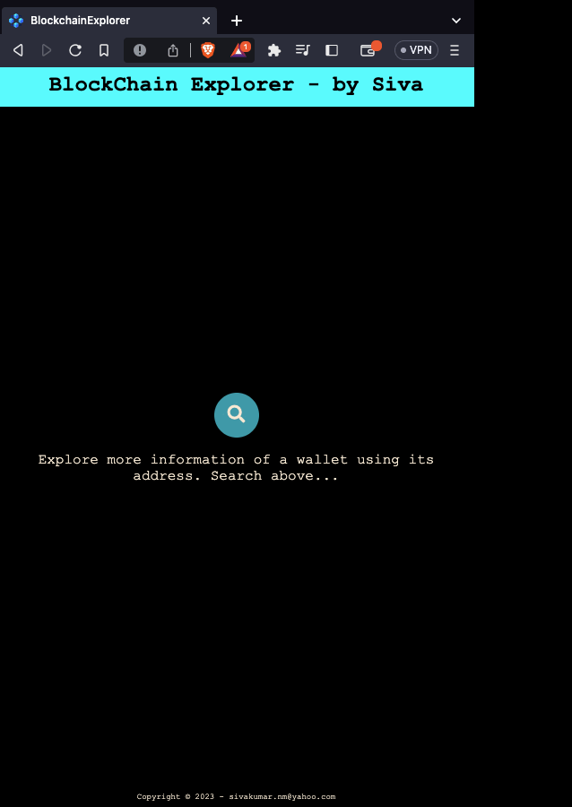

# BlockchainExplorer

BlockchainExplorer helps searching (Etherium) wallet address to get more details about it.

note: Application uses [EtherScanAPI](https://etherscan.io/apis) to gain access to wallet details

## Installation

## Development server

Run `ng serve` for a dev server. Navigate to `http://localhost:4200/`. The application will automatically reload if you change any of the source files.

## Build

Run `ng build` to build the project. The build artifacts will be stored in the `dist/` directory.

## Deployment

The application uses [Netlify](https://www.netlify.com/?utm_source=google&utm_medium=paid_search&utm_campaign=12755510784&adgroup=118788138897&utm_term=netlify&utm_content=kwd-309804753741&creative=514583565825&device=c&matchtype=b&location=9044951&gad=1) as its deployment platform.

Refer [Hosted production app link](https://main--aquamarine-frangipane-063b64.netlify.app/)
